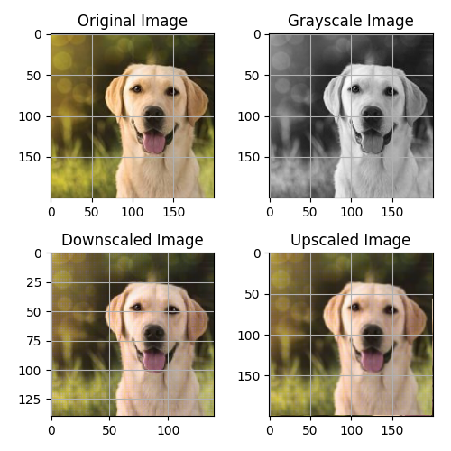

# Image Processing from Scratch

This repository contains a simple image processing program that performs various operations on an image without using any image processing libraries (such as OpenCV). The program is implemented natively in Python.

## Program Overview

The image processing program accomplishes the following tasks:

1. **Load an Image:** The program loads an image from the disk. You can provide the path to the image you want to process.

2. **Convert to Gray-Scale:** The loaded image is converted to gray-scale (8bpp format) using the luminance method.

3. **Downscale Image:** The program resamples the gray-scale image, reducing its size to 70% of the original dimensions using linear interpolation. The downsampled image is then saved.

4. **Upscale Image:** The previously downscaled image is resized back to its original dimensions using linear interpolation. The upscaled image is then saved.

5. **Compute Image Difference:** The program calculates the sum of the average squared differences between pixels in the original gray-scale image (from step 2) and the re-sampled image (from step 4).


## Expected Results




## Article for further details

[A Guide to Image Processing from Scratch](https://medium.com/@lahiru.19/a-guide-to-image-processing-from-scratch-7a6a413fb682)


## Usage

1. Clone this repository to your local machine:

   ```bash
   git clone https://github.com/lahirub99/image-processing-from-scratch.git
